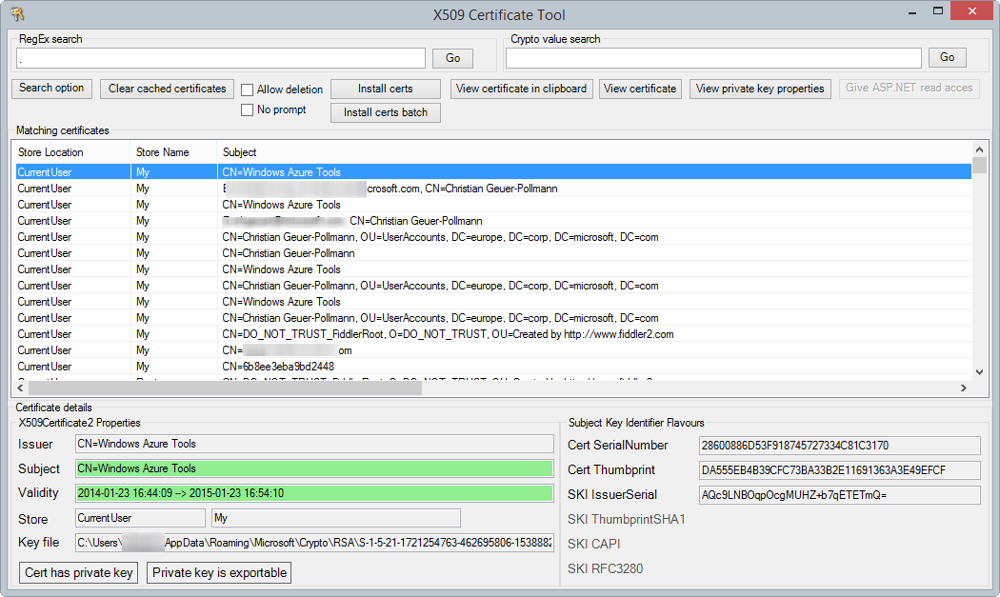
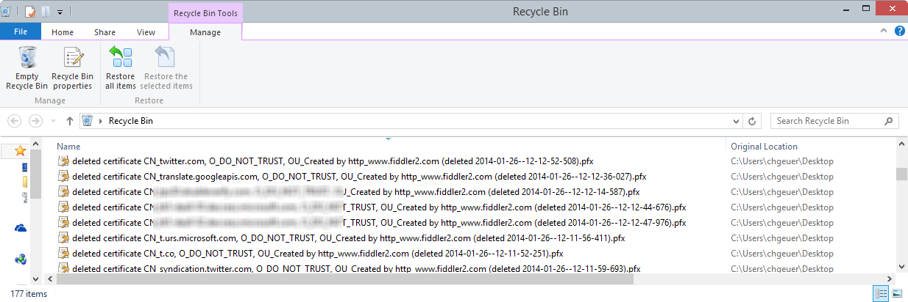

X509CertificateUtility
======================

This is a 1:1 copy of my old project which I published on [MSDN](http://archive.msdn.microsoft.com/Project/Download/FileDownload.aspx?ProjectName=netfxsamples&DownloadId=3395).

http://blogs.msdn.com/b/chgeuer/archive/2008/12/16/x509-certificate-tool.aspx

## Warning when deleting files

Please note: 

> This version allows you to easily delete certificates from the different stores. When you delete a certificate which has no belonging private key, then the certificate is first exported into a file, then the file is moved into your Recycle Bin, and then the actual certificate is deleted from the store. 
> 
> When you delete a certificate with a private key, and the private key is not maked as exportable, then the tool refuses to delete the certificate. When the private key is exportable, then the cert and it's private key are exported into a PFX file (WITH AN EMPTY PASSWORD) and dumped into the Recycle Bin. So deleting certs with private key means there private keys are unprotected in your recycle bin!!! !!! !!!

